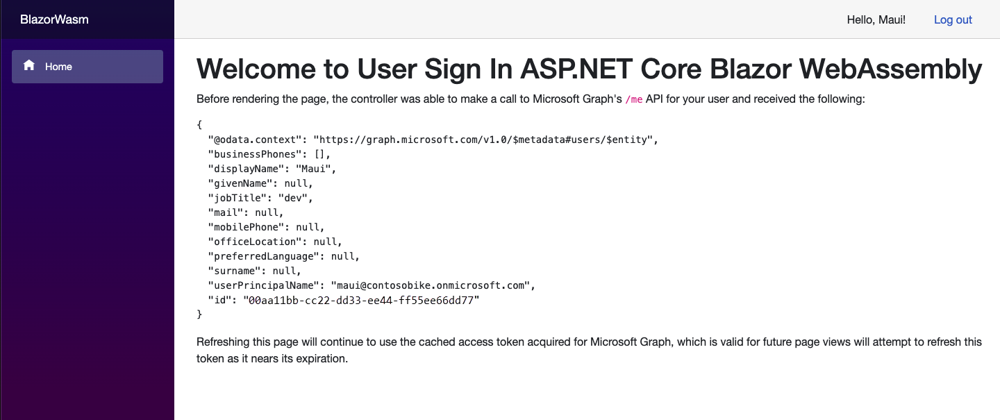
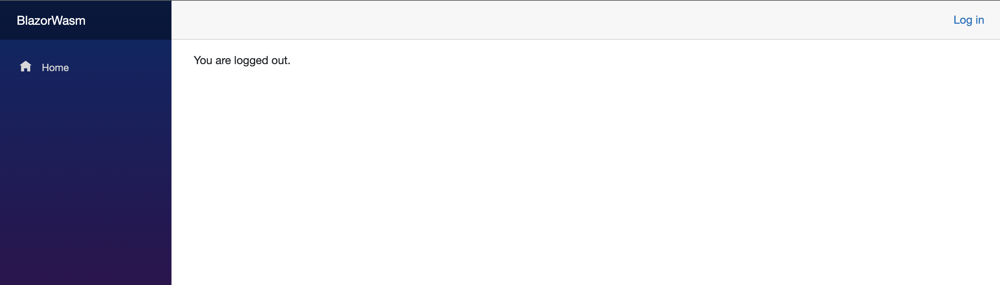

# Consultologist

A clinical consult-note generation app. The frontend is a standalone ASP.NET Core Blazor
WebAssembly PWA (Fluent UI, Microsoft Entra ID sign-in via MSAL); the backend is a .NET 10
isolated Azure Functions app that runs durable consult-generation jobs against Azure AI
Foundry agents and streams progress to the browser over server-sent events (SSE).



## Repository layout

```
/
├── Consultologist.sln           solution covering all three projects
├── src/
│   ├── Consultologist.Web/      Blazor WASM frontend (Pages/, Shared/, Services/, wwwroot/)
│   └── Consultologist.Api/      Azure Functions backend (deployed separately)
├── tests/                       xUnit tests for the API project
├── docs/                        design docs and research notes — see docs/README.md
├── scripts/                     smoke-test scripts
├── build/                       centralized bin/obj output (gitignored)
└── .github/workflows/           frontend deploy, API deploy, tests
```

## Prerequisites

- [.NET 10 SDK](https://dotnet.microsoft.com/download)
- The WebAssembly build tools: `dotnet workload install wasm-tools`
- An Azure subscription with a Microsoft Entra tenant (for sign-in and deployment)

## Setup

### 1. Register the app in Microsoft Entra ID

Follow [Register an application with the Microsoft identity platform](https://learn.microsoft.com/entra/identity-platform/quickstart-register-app) with:

| Setting | Value |
|---|---|
| **Supported account types** | Accounts in this organizational directory only (single tenant) |
| **Platform type** | Single-page application |
| **Redirect URI** | `http://localhost:5000/authentication/login-callback` |

### 2. Configure the frontend

In `src/Consultologist.Web/wwwroot/appsettings.json`, set the values from your app registration:

```json
"Authority": "https://login.microsoftonline.com/<tenant ID>",
"ClientId": "<client ID>",
```

## Run

```bash
# Frontend (serves on http://localhost:5000)
dotnet run --project src/Consultologist.Web

# Backend (Azure Functions Core Tools; or use the VS Code build/run tasks)
cd src/Consultologist.Api && func start
```

Sign in with an Entra account, then sign out from the header when done.



## Tests

```bash
dotnet test
```

## Deployment

Three GitHub Actions workflows under `.github/workflows/`:

- **Azure Static Web Apps** — builds and deploys `src/Consultologist.Web` on pushes to `main` (with PR preview environments).
- **Azure Function App** — builds and deploys `src/Consultologist.Api` on pushes to `main` that touch it.
- **Tests** — runs the xUnit suite on pushes and pull requests.

## Documentation

Design and operations notes live in [`docs/`](./docs/README.md) — consult generation
workflow and events, durable jobs, SSE design, accounts and auth, storage, and research
notes.
