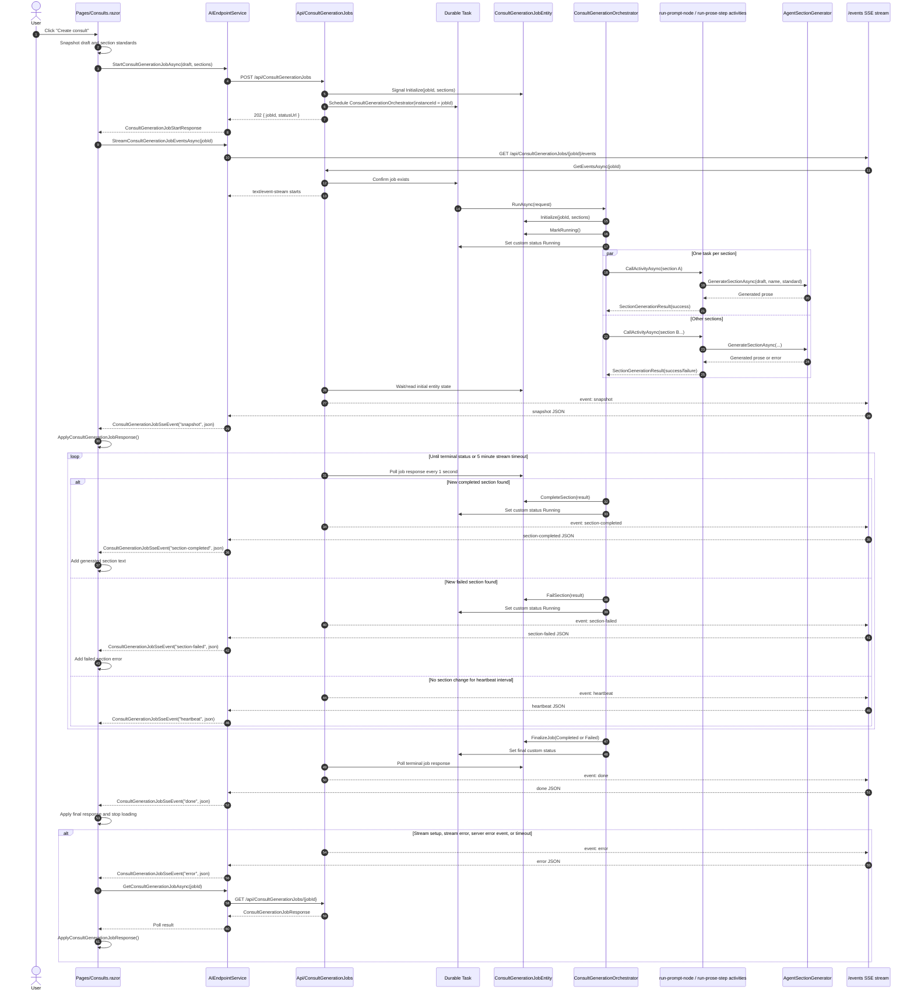

# Consult Generation Event Flow

> **Updated for Milestone 5 (2026-07-15)**: the engine executes one node kind with
> per-(node, item) scheduling. The event *surface* is unchanged — `node-completed`
> fires per node-level completion (a forEach node completes when its last item
> settles), and `section-prose-step` events are synthesized from per-item node
> completions with identical payloads (step ids = the forEach chain's node ids).

This is the current consult generation flow after the .NET 10 SSE migration.

## Event Contract

The `/events` endpoint emits these server-sent event names:

- `snapshot`: initial full `ConsultGenerationJobResponse`.
- `node-completed`: one DAG node's completion (or the map node's start), with
  `JobId`, `NodeId`, package-declared `Label`, `Message`, and node counts
  (milestone 4; replaces the fixed analysis stage events).
- `section-prose-step`: per-section prose progress with the step id, package-declared
  `Label`, `Message`, and step counts (milestone 3; replaces the fixed step-named
  events).
- `section-completed`: one completed section with `JobId`, `SectionId`, and generated `Text`.
- `section-failed`: one failed section with `JobId`, `SectionId`, and `Error`.
- `heartbeat`: stream keepalive with `JobId` and current `Status`.
- `done`: final full `ConsultGenerationJobResponse`.
- `error`: stream-level failure with `JobId` and `Error`.

Legacy event names (`analysis-started`, `concepts-extracted`, …,
`section-standard-draft-created`, …) are never emitted for new jobs but replay from
the event store for jobs that ran before milestones 3–4; the client ignores them.

Semantic events include persisted `id:` values in the form `{jobId}:{sequence:D12}`. Heartbeat events are not persisted and do not advance the semantic event sequence.

The Blazor page treats `snapshot`, `node-completed`, `section-prose-step`, `section-completed`, `section-failed`, and `done` as live UI update events. It falls back to polling `GET /api/ConsultGenerationJobs/{jobId}` when stream setup fails, the stream times out, the stream ends before `done`, event handling fails, or the server emits `error`.
